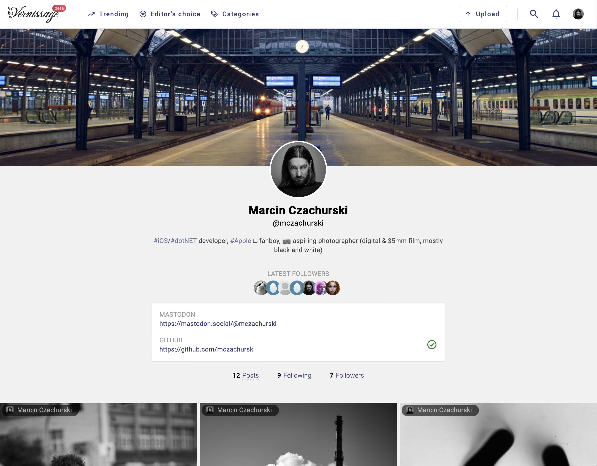

# Vernissage Web

[](https://github.com/VernissageApp/VernissageWeb/actions/workflows/build.yml)
[](https://www.typescriptlang.org)
[](https://angular.dev)
[](https://nodejs.org)
[](https://nodejs.org)

Web client for **Vernissage**, a federated, photo-first social platform connected to the fediverse through **ActivityPub**.

This repository contains the Angular application used to browse timelines, publish content, manage accounts, moderate content, and work with server settings from the browser. It supports SSR, hydration, service worker updates, and production deployment through Docker.

<p align="center">
  
  
</p>

## Highlights

- Angular 21 application with server-side rendering and client hydration
- Photo-focused timelines, profiles, search, upload, bookmarks, favourites, and notifications
- Authentication flow based on access token refresh, cookies, and XSRF protection
- PWA support with Angular service worker update handling
- Configurable instance branding through public settings, custom CSS, and custom JS
- Shared product surface with the Vernissage API and iOS client

## Quick Links

- Project website: [joinvernissage.org](https://joinvernissage.org)
- Documentation: [docs.joinvernissage.org](https://docs.joinvernissage.org)
- API server: [VernissageServer](https://github.com/VernissageApp/VernissageServer)
- iOS client: [VernissageMobile](https://github.com/VernissageApp/VernissageMobile)
- Create an account: [vernissage.photos](https://vernissage.photos)

## Requirements

- Node.js 24
- npm
- a running Vernissage API server, usually available on `http://localhost:8080` during local development

For backend setup, see [VernissageServer](https://github.com/VernissageApp/VernissageServer).

## Getting Started

1. Clone the repository.
2. Install dependencies:

```bash
$ npm install --force
```

3. Start the local development server:

```bash
$ npm start
```

4. Open [http://localhost:4200](http://localhost:4200).

The app reloads automatically when source files change.

## Development Commands

```bash
$ npm start      # Angular dev server
$ npm run build  # Production browser + server build
$ npm run lint   # ESLint
$ npm test       # Karma/Jasmine tests
$ npm run serve:ssr
```

## How This App Fits Into Vernissage

The web client talks to the **Vernissage Server** HTTP API. In local development it expects:

- web app on `http://localhost:4200`
- API server on `http://localhost:8080`

In deployed environments the client usually talks to the API on the same public host. The backend then connects to PostgreSQL or SQLite, Redis, and S3-compatible object storage depending on deployment mode.

## Architecture

The repository follows a UI-oriented Angular structure:

- `src/app/pages` - route-level screens such as home, profile, upload, settings, search, and moderation pages
- `src/app/components` - reusable UI building blocks, split into `core` layout parts and `widgets`
- `src/app/dialogs` - modal flows and edit dialogs
- `src/app/services/http` - API clients grouped by backend resource
- `src/app/services/common` - browser, SSR, loading, routing, preferences, and UI support services
- `src/app/services/authorization` - sign-in state, refresh-token flow, and route guards
- `src/app/models` - API and view models
- `src/app/directives`, `src/app/pipes`, `src/app/validators` - shared template utilities
- `server.ts` - Express-based SSR entrypoint with optional security headers

### Runtime Flow

At startup the app:

1. tries to refresh the access token,
2. loads instance metadata and public settings from the API,
3. injects custom scripts and styles exposed by the server,
4. hydrates the Angular application in the browser,
5. registers the service worker outside development mode.

Request handling is centered around:

- `APIInterceptor`, which adds `withCredentials` and the `X-XSRF-TOKEN` header,
- `AuthorizationService`, which refreshes expired sessions,
- `GlobalErrorHandler`, which maps failures to dedicated error pages and reports unexpected client-side errors.

### Routing Model

Routes are defined in [`src/app/pages/pages-routing.module.ts`](src/app/pages/pages-routing.module.ts). The application mixes public pages and authenticated areas:

- public: home, news, public profiles, status pages, FAQ, terms, privacy
- authenticated: upload, notifications, invitations, account, settings, reports, shared cards, moderation views

Several gallery-like views use route reuse and shared context state to preserve timeline data when navigating between screens.

## Repository Layout

- `src/main.ts` and `src/main.server.ts` - browser and server bootstrap
- `src/app/app.module.ts` - root module, hydration, service worker, interceptors, global error handler
- `src/app/pages/pages.module.ts` - all route-level page declarations
- `src/styles` - global SCSS variables, fonts, utilities, and layout helpers
- `src/assets` - icons, fonts, screenshots, and bundled client assets
- `Dockerfile` - multi-stage SSR image build
- `.github/workflows/build.yml` - CI build, lint, test, and production build verification

## SSR, PWA, and Deployment

The production build includes both browser assets and a server bundle. SSR is served through Express and `@angular/ssr`, while static assets are emitted to `dist/VernissageWeb/browser`.

Build locally:

```bash
$ npm run build
$ npm run serve:ssr
```

Build a Docker image:

```bash
$ docker build -t vernissage-web .
$ docker run --rm -p 8080:8080 vernissage-web
```

Production images are published to [Docker Hub](https://hub.docker.com/repository/docker/mczachurski/vernissage-web).

## Security Headers

When running the SSR server in production, it is recommended to enable the image source used in the Content Security Policy through the `VERNISSAGE_CSP_IMG` environment variable:

```bash
export VERNISSAGE_CSP_IMG=https://s3.eu-central-1.amazonaws.com
```

This value is used by `server.ts` to extend the `Content-Security-Policy` header for remote image loading.

## Contributing

Contributions are welcome.

1. Keep changes focused and aligned with the existing module structure.
2. Run `npm run lint`, `npm test`, and `npm run build` before opening a pull request.
3. Document any behavior changes that affect SSR, authentication, or deployment.

## License

This project is licensed under the [Apache License 2.0](LICENSE).
